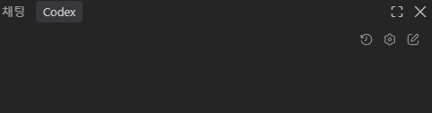
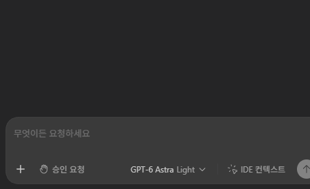
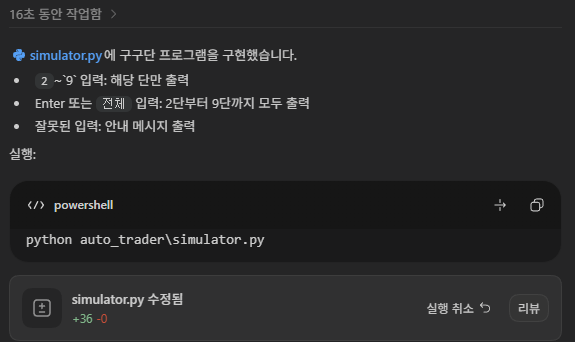

# ai-vibecoding-2026

바이브코딩 리포지토리

### Chapter 1

AI에게 코딩을 시키자, 제대로!

### 개념

코딩을 직접하지는 말 것 . AI와 협업해서 새로운 프로그램을 만들자

#### 기존 개발 방법

요구사항 분석 -> 설계(DB/UI 포함) -> 구현/디버깅 -> 테스트 -> 배포 -> 유지보수

#### 바이브코딩 방식

요구사항 정의(PRD) -> AI 코드생성/디버깅,테스트 -> 사람 **검증** 수정 요청, 직접수정 ->배포 -> AI 유지보수

#### 핵심 포인트

- AI - 주니어/시니어 개발
- 사람 - PM + 리뷰어

### 바이브코딩 개발환경

- VS Code , VS Code Insider, Andrios Studio, ...

#### VS code

- 채팅 창 - 안씀
- 확장 패키지 - Codex, Claude Code for VS Code , Gemini Code Assist

#### Codex

- 설치 후 확장 아이콘 아래 , Codex 아이콘 생성 됨

- 로그인 - 웹 브라우저 연결
- 설정하면 설정 필요

- 추가파일 Codex-*-sandbox.exe 파일설치

- 최종 화면
- 채팅 창 명령 / 여러 LLM에 전달할 명령어 리스트

#### 바이브코딩 맛보기

- 제로샷 프롬프트로 요청

- 결과 메세지 화면
- 소스

#### CLI Codex

- 파워쉘, 콘솔 창에서 명령어로 수행하는 Codex
