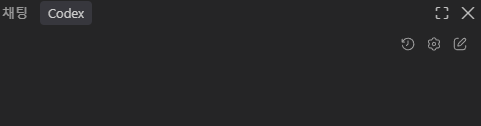
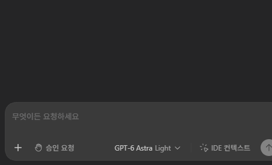
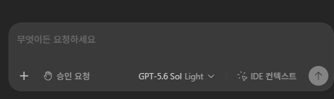
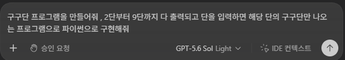
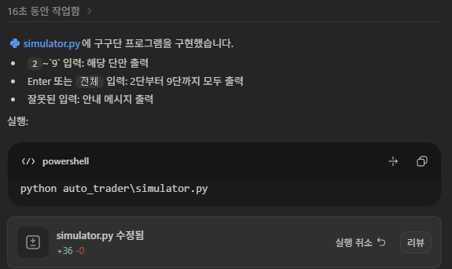
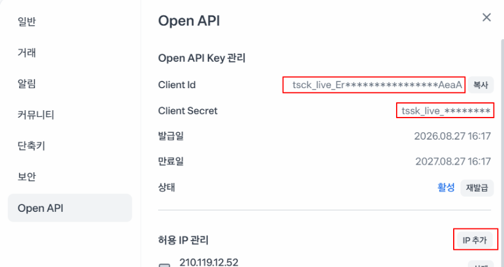

# ai-vibecoding-2026

### 자동매매 일일 사용금액

화면의 **매매 내역**에서 체결 시각(한국 시간), 종목명·코드, 매수/매도, 체결 수량, 체결 단가, 거래금액, 상태(자동/수동)를 확인할 수 있습니다. 최신 거래가 위에 표시되며 30초마다 갱신됩니다. 거래금액은 체결 단가 × 체결 수량이며, 직접 매도한 내역도 포함됩니다.

- 보유 포지션의 상태 옆 **전량 매도** 버튼으로 직접 PAPER 매도할 수 있습니다. 종목과 수량 확인 후 최신 조회 시세로 가상 체결하며, 실제 계좌 주문은 발생하지 않습니다. 자동매매 중지 상태에서도 사용할 수 있습니다.
- 최신 시세 조회 실패 시 매도하지 않습니다. 확인 후 보유 수량이 변했거나 이미 자동매도된 경우 요청을 거절하며, 새로고침 후 다시 확인해야 합니다.
- 직접 매도한 종목은 당일 자동 재매수에서 제외합니다. 다른 종목의 자동매매는 계속되며 일일 매수 사용액은 매도로 복원되지 않습니다.
- 수동 전량 매도 API: `POST /api/v1/positions/{symbol}/sell` (`quantity`: 확인한 보유 수량, `client_order_id`: 중복 방지 요청 ID).

- 수동 가상주문 입력과 추천 카드의 수동 매수 버튼은 제거했습니다. `자동매매 시작`으로 PAPER 자동매매를 실행합니다.
- 추천 TOP 5는 참고용으로만 표시합니다. 자동매매 시작 시 추천 목록과 무관하게 토스의 국내 시장 전체 거래량 상위 100개와 당일 상승률 상위 100개를 비교해 후보를 찾습니다.
- 매수 후보는 두 랭킹에 모두 포함되고 당일 상승률이 1% 이상인 종목입니다. 상승률과 거래량 순위를 점수화해 가장 높은 후보부터 판단합니다. 이는 외부 LLM/AI 예측이 아니라 규칙 기반 모멘텀 스크리너입니다.
- 매수는 최대 5종목에 분산하며 하루 최대 4회, 회차 간 최소 15분을 둡니다. 회차마다 조건을 충족하는 종목을 점수순으로 선택하고, 종목당 하루 한도의 최대 5%씩 매수합니다(4회 합계 종목당 최대 20%). 한 종목의 기존 보유 원금이 이 한도를 넘으면 추가 매수하지 않습니다.
- 예: 하루 한도 400만 원이면 회차마다 최대 5종목에 각각 20만 원, 회차 합계 최대 100만 원을 사용합니다. 후보가 적거나 1주 가격이 배정액보다 비싸면 남은 금액을 다른 종목에 몰아주지 않고 현금으로 남깁니다. 매수 주문 여러 건을 묶어 분할 1회로 계산하며, 4회 또는 일일 한도에 도달하면 추가 매수하지 않습니다.
- 보유 종목이 평균 매수가 대비 -3% 이하이면 손절, +10% 이상이면 익절하여 전량 PAPER 매도합니다. 분할 매수 후에는 갱신된 평균 매수가를 기준으로 판단하며, 상승·거래량 조건 이탈 시에도 전량 매도합니다. 매도한 종목은 당일 자동 재매수하지 않습니다.
- 매도 조건은 모든 보유 종목에 대해 자동매매 실행 중 약 60초 간격으로 확인합니다. 일부 종목의 시세 조회에 실패하면 해당 종목의 자동매도와 신규 매수는 보류하되, 정상 조회된 다른 종목의 매도는 판단합니다. 조회 가격으로 가상 체결하므로 정확히 -3%/+10% 가격에 체결된다는 보장은 없습니다. 중지 버튼은 반복 매매만 멈추며 보유 주식을 강제로 매도하지 않습니다.
- 계좌 요약에는 가용계좌 금액, 하루 추천 사용금액(40%), 평가손익, 수익률을 표시합니다.
- 기본 비율은 40%이며, 계좌 요약에서 0~100%로 변경할 수 있습니다. 변경한 비율은 오늘 누적 매수 한도에 즉시 반영되며, 이미 사용한 금액보다 한도가 낮아지면 잔여 한도는 0원이 됩니다.
- 첫 자동매매 시작 시 현재 가용 현금과 설정 비율로 그날의 매수 한도를 계산합니다. 시작 전 화면의 금액은 현재 현금 기준 예상 한도입니다.
- 매수 신호가 나오면 해당 분할 몫·잔여 한도·가용 현금 안에서 살 수 있는 최대 정수 수량을 매수합니다. 한 회차 예산으로 1주도 살 수 없으면 매수를 건너뜁니다.
- 같은 날 중지·재시작하거나 종목을 바꿔도 사용액을 유지합니다. 매도대금으로 하루 매수 한도가 늘어나지 않습니다.
- 한국 시간 자정 이후 첫 자동매매 처리 시 당시 가용 현금으로 새 한도를 계산합니다. 추천 카드의 최대 수량은 잔여 한도 기준입니다.
- 이 한도는 PAPER 자동매매에 적용하며, 수동 주문은 별도입니다. 잔고·보유주식·주문·일일 사용액·분할 횟수·재매수 제외 종목·설정 비율은 `data/paper-state.json`에 자동 저장되어 재시작 후 복원됩니다. 파일은 Git에서 제외됩니다. 저장 실패 시 해당 주문/변경을 취소하며 손상된 파일을 발견하면 계좌를 초기화하지 않고 서버 시작을 중단합니다.
- 새 계좌의 기본 비율은 `.env`의 `AUTO_BUY_BUDGET_PERCENT`입니다. 저장된 계좌가 있으면 저장된 비율을 우선합니다. 재시작 후 자동매매는 안전을 위해 중지 상태로 복원되므로 `자동매매 시작`을 눌러 재개합니다. 한 계좌 파일에는 서버 프로세스를 하나만 실행하세요(`--workers` 증설 금지).

후보 스캐너는 토스 랭킹 API가 시장 전체 기준으로 반환하는 거래량·등락률 랭킹(각 최대 100개)을 사용합니다. 따라서 모든 상장 종목의 호가/차트를 매번 개별 호출하는 구조가 아니며, 토스 랭킹에 잡히지 않은 종목은 해당 주기에 후보에서 제외될 수 있습니다. 토스 공식 문서에는 테마 분류 랭킹이 없어 테마는 사용하지 않습니다.

서버 실행: `python -m app` (접속 주소: `http://127.0.0.1:8000`). 서버 코드 변경은 재시작 후 적용됩니다.

바이브코딩 리포지토리

### Chapter 1

AI에게 코딩을 시키자, 제대로!

### 개념

코딩을 직접하지는 말 것 . AI와 협업해서 새로운 프로그램을 만들자

#### 기존 개발 방법

요구사항 분석 -> 설계(DB/UI 포함) -> 구현/디버깅 -> 테스트 -> 배포 -> 유지보수

#### 바이브코딩 방식

요구사항 정의(PRD) -> AI 코드생성/디버깅,테스트 -> 사람 **검증** 수정 요청, 직접수정 ->배포 -> AI 유지보수

#### 핵심 포인트

- AI - 주니어/시니어 개발
- 사람 - PM + 리뷰어

### 바이브코딩 개발환경

- VS Code , VS Code Insider, Andrios Studio, ...

#### VS code

- 채팅 창 - 안씀
- 확장 패키지 - Codex, Claude Code for VS Code , Gemini Code Assist

#### Codex

- 설치 후 확장 아이콘 아래 , Codex 아이콘 생성 됨

- 로그인 - 웹 브라우저 연결
- 설정하면 설정 필요

- 추가파일 Codex-*-sandbox.exe 파일설치

- 최종 화면
- 채팅 창 명령 / 여러 LLM에 전달할 명령어 리스트

#### 바이브코딩 맛보기

- 제로샷 프롬프트로 요청

- 결과 메세지 화면
- 소스

#### CLI Codex

- 파워쉘, 콘솔 창에서 명령어로 수행하는 Codex

### 바이브 코딩

- 제로샷 프롬프트 : 아무런 기초지식없이 대화로 바이브코딩
- 원샷 프롬프트 : 적어도 한줄의 요구사항을 작성해서 바이브코딩
- 퓨샷 프롬프트 : PRD를 작성해서 바이브코딩

#### 프롬프트 사용법

- 이미지를 캡쳐해서 복사/붙여넣기 후 프롬프트 사용
- 특정 소스코드를 선택한 뒤 우클릭으로 `Add to codex threaed` 선택 후 프롬프트 사용

### 주식 자동매매 개발환경

#### 토스증권 OpenAPI

- https://corp.tossinvest.com/lo/open-api
- 토스앱 모바일 설치 가입
- 토스증권 사용 설정
- 토스증권 PC 웹사이트 동작
- 사용중인 아이피를 토스증권 PC 등록
- OpenAPI 키 발급 후 ClientID , Client Secret 문자열 보관
- https://developers.tossinvest.com/docs

### API 신청하기

- https://corp.tossinvest.com/ko/open-api
- PC에서 투자하기 클릭
- 토스앱 모바일로 로그인 인증
- 오른쪽 하단 기어모양 아이콘(설정)

- Client Id, Client Secret, IP 추가
- cmd > ipconfig로 보인 아이피 확인 후 추가

### 주식 자동매매 파이썬 프로그램 분석

- `__init__.py` - 일반적으로 파일만 생성. 소스코드 X , 프로젝트 폴더가 pip로 설치할 수 있는 패키지화
- `__main__.py` - 파이썬으로 실행될때 가장 먼저 실행되는 메인 함수 파일
- `__pycahe__` - 미리 만들어놓은 파이썬 실행 파일(캐시)
- tests - 소스코드 테스트 실행을 위한 폴더
- .env.example - 환경 설정 예제파일 .example을 지우고 사용
    .env 는 깃허브에 업로드 방지위해 .gitignore에 제외파일로 등록
- requriements.txt - 파이썬 개발환경 패키지 설치리스트 파일
    - `pip install -r requirements.txt` 로 설치    

#### HTTP 403 문제

